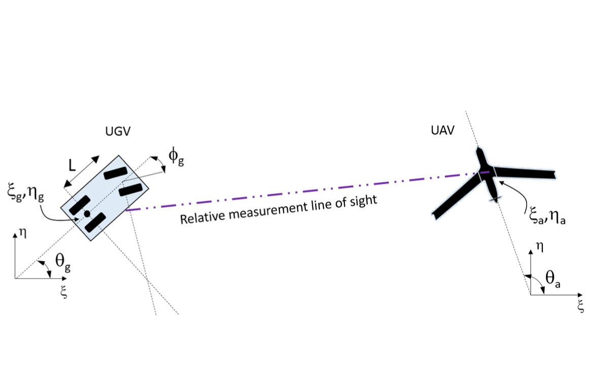
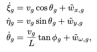
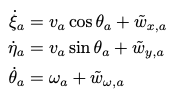
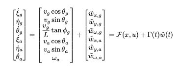
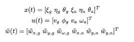
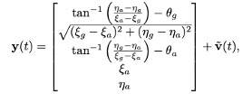
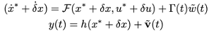
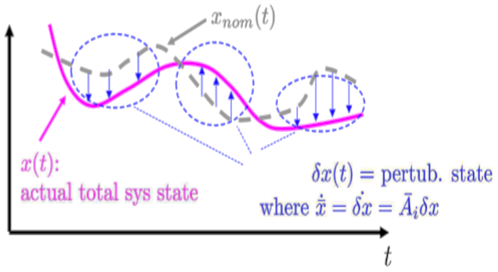
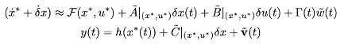
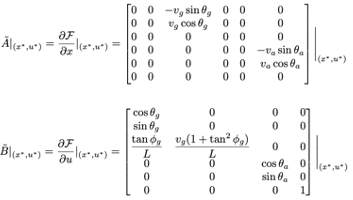

# Cooperative Air-Ground Robot Localization

The UGV’s motion is modeled kinematically here as a simple 4-wheeled steerable Dubin’s car 

The fixed-wing UAV motion is modeled kinematically as a simple Dubin’s unicycle 

## System Model
The nonlinear equations of motion describing the Cooperative Air-Ground Robot Localization system is defined as: 

The combined system state, control inputs, and disturbance inputs are 

The measurement model for the system is given by a combination of noisy ranges and azimuth angles of the UGV relative to the UAV and noisy UAV GPS measurements 

## Linearization
The continuous-time nonlinear dynamics and measurement models can be linearized by first assuming that the system stays near a nominal trajectory x*(t) for some nominal control input u*

Using Taylor Series expansion near x∗, the CT linearized system is approximated as:

