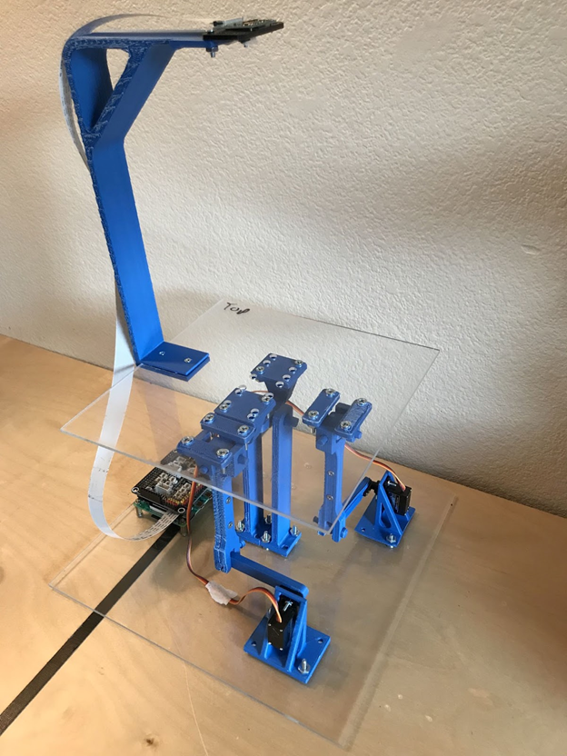

---

layout: default
---

Hello,

I am Faizan, a graduate student in the mechanical engineering department at University of Colorado Boulder with a focus on robotics and controls.
I have about 2.5 years of professional work experience in control system design for automotive domain.
I am interested in working in the field of robotics and control design.


# EDUCATION

___

- ### **University of Colorado Boulder**

    **Master of Science** in Mechanical Engineering    &emsp;    &emsp;&emsp;&emsp;                                  GPA- 3.75/4.0
    
    > __Relevant Coursework:__ Linear Control Systems, Mechatronics and Robotics, Feedback Control, Computer Vision, Algorithmic Motion Planning, Statistical  Estimation for Dynamical Systems, Bio-Inspired Robotics, Control Systems Lab

<br>

- ### **Thapar Institute of Engineering and Technology**

   **Bachelor of Engineering** in Mechanical Engineering    &emsp;    &emsp;&emsp;&emsp;                             GPA- 7.5/10.0
   
   > __Relevant Coursework:__ IC Enginess, Automotive Engineering, Dynamics, Kinematics, Rapid Prototyping, CAD & Analysis, Mechatronics.


# WORK EXPERIENCE

___

- ## Qualcomm Inc.

     **Motion Planning Intern** &emsp;    &emsp;&emsp;&emsp;  &emsp;   &emsp;    &emsp;&emsp;&emsp;    &emsp;&emsp;&emsp; **Summer 2022**
 
- ## DENSO

     **R&D Engineer**  &emsp;    &emsp;&emsp;&emsp;  &emsp;   &emsp;    &emsp;&emsp;&emsp;    &emsp;&emsp;&emsp; **2018 - 2020**

- ## Engine Control Lab, Taipei Tech

     **Research Assistant**  &emsp;    &emsp;&emsp;&emsp;  &emsp;  &emsp;    &emsp;&emsp;&emsp;     &emsp;&emsp;&emsp; **Spring 2017**


# PROJECTS

|||
|:-:|:-:|
|<a href="./Portfolio/fsae.md">  </a>|<a href="./Portfolio/Ball_balancer.md"></a>|


# PUBLICATIONS

[[1] Wu, Y.-Y.; Wang, J.H.; Mir, F.M. Improving the Thermal Efficiency of the Homogeneous Charge Compression Ignition Engine by Using Various Combustion Patterns. Energies 2018, 11, 3002.](https://doi.org/10.3390/en11113002)

# CONTACT


Welcome to markdown madness. We hope you **really** enjoy using good old text for writing.

Just type some [markdown](http://en.wikipedia.org/wiki/Markdown)
and jekyll will automatically turn it into hypertext markup language (HTML). *Simple as that.*

> Quote goes here.

A list:

- One
- Two
- Three

Some inline code `to_html` and a preformatted code block:

```
Kramdown::Document.new( 'Hello Markdown!' ).to_html
```

with code highlighting:

``` ruby
# The Greeter class

class Greeter
  def initialize(name)
    @name = name.capitalize
  end

  def salute
    puts "Hello #{@name}!"
  end
end

# Create a new object
g = Greeter.new("world")

# Output "Hello World!"
g.salute
```

Or try

# Heading 1

## Heading 2

### Heading 3

